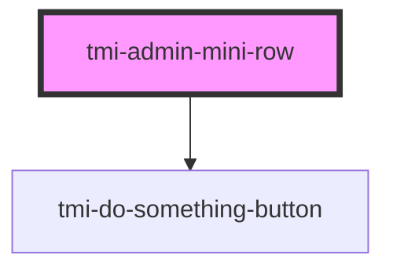

# tmi-admin-mini-row

<!-- Auto Generated Below -->

## Properties

| Property    | Attribute   | Description | Type     | Default     |
| ----------- | ----------- | ----------- | -------- | ----------- |
| `miniid`    | `miniid`    |             | `string` | `undefined` |
| `name`      | `name`      |             | `string` | `undefined` |
| `source`    | `source`    |             | `string` | `undefined` |
| `tagdata`   | `tagdata`   |             | `string` | `undefined` |
| `thumbnail` | `thumbnail` |             | `string` | `undefined` |
| `type`      | `type`      |             | `string` | `undefined` |

## Dependencies

### Depends on

- [tmi-do-something-button](../tmi-do-something-button)

### Graph

----------------------------------------------

*Built with [StencilJS](https://stenciljs.com/)*
