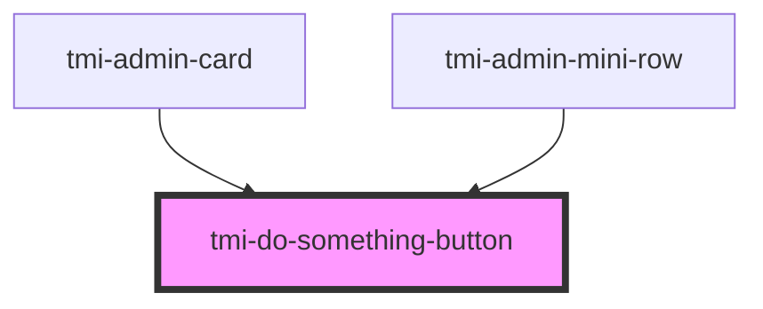

# tmi-do-something-button

<!-- Auto Generated Below -->

## Properties

| Property   | Attribute  | Description | Type     | Default     |
| ---------- | ---------- | ----------- | -------- | ----------- |
| `data`     | `data`     |             | `string` | `undefined` |
| `method`   | `method`   |             | `string` | `undefined` |
| `text`     | `text`     |             | `string` | `undefined` |
| `tmistyle` | `tmistyle` |             | `string` | `undefined` |
| `url`      | `url`      |             | `string` | `undefined` |

## Events

| Event            | Description | Type                   |
| ---------------- | ----------- | ---------------------- |
| `fetchCompleted` |             | `CustomEvent<boolean>` |

## Dependencies

### Used by

 - [tmi-admin-card](../tmi-admin-card)
 - [tmi-admin-mini-row](../tmi-admin-mini-row)

### Graph

----------------------------------------------

*Built with [StencilJS](https://stenciljs.com/)*
